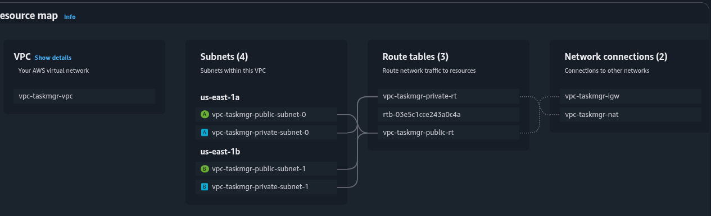

This VPC is deploy for ECS containing the taskmgr app

# LATEST OUTPUT(20250517am):
igw_id = "igw-083e886f271ee1c5b"
private_subnets = [
  "subnet-0a69e2e76adabc1d7",
  "subnet-0a0d822481e56901b",
]
public_subnets = [
  "subnet-0ae3f7807ebb197ca",
  "subnet-0e75293eecb595b64",
]
vpc_eip = "eipalloc-05b7659790743269d"
vpc_id = "vpc-0cd6a3193c85b65df"
vpc_nat = "nat-028697a7d24b213ce"